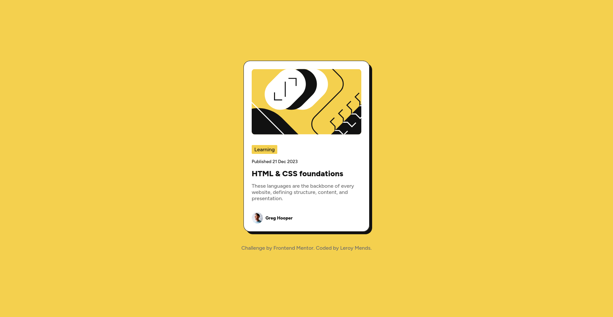
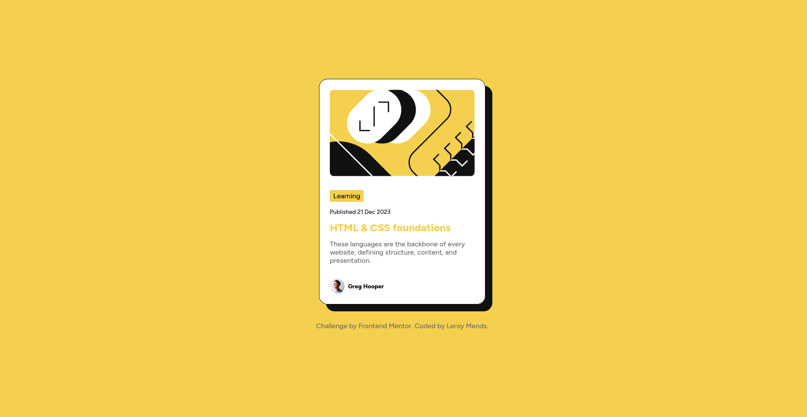

# Frontend Mentor - Blog preview card solution

This is a solution to the [Blog preview card challenge on Frontend Mentor](https://www.frontendmentor.io/challenges/blog-preview-card-ckPaj01IcS). Frontend Mentor challenges help you improve your coding skills by building realistic projects. 

## Table of contents

- [Frontend Mentor - Blog preview card solution](#frontend-mentor---blog-preview-card-solution)
  - [Table of contents](#table-of-contents)
  - [Overview](#overview)
    - [The challenge](#the-challenge)
    - [Screenshot](#screenshot)
    - [Links](#links)
  - [My process](#my-process)
    - [Built with](#built-with)
    - [What I learned](#what-i-learned)
    - [Continued development](#continued-development)
    - [Useful resources](#useful-resources)
    - [AI Collaboration](#ai-collaboration)
  - [Author](#author)

## Overview

### The challenge

Users should be able to:

- See hover and focus states for all interactive elements on the page

### Screenshot




### Links

- Solution URL: [GitHub Solutions](https://github.com/mpartisan1000/blog-preview-card.git)
- Live Site URL: [Blog Card Website](https://blogcardwebpage.vercel.app/)

## My process

### Built with

- Semantic HTML5 markup
- CSS custom properties
- Flexbox
- CSS Grid

### What I learned

I learned how to change the positions of my elements using css grids

```html
<h1>Some HTML code I'm proud of</h1>
<div class="c1"></div>
<div class="c2"></div>
<div class="c3"></div>
<div class="c4"></div>
```

```css
.proud-of-this-css {
  display: grid;
  grid-template-areas: "c1" "c2" "c3" "c4";

}

.c1 {
  grid-area: 1;
}

.c1 {
  grid-area: 3;
}

.c1 {
  grid-area: 2;
}

.c1 {
  grid-area: 4;
}
```

### Continued development

Well, I am not really comfortable with using css grids and flexbox. Still struggling with positioning and responsive css. Also my knowledge of mobile workflow and transitionings are still amateurish.

### Useful resources

- [W3schools | Box Shadow](https://www.w3schools.com/Css/css3_shadows_box.asp) - This helped me to have an indepted understanding of box shadow.

### AI Collaboration

I used ChatGpt to help understand the innerworkings of why my code was messing up:

- So I realized that the contents of webpage weren't adjusting, so I asked Chatgpt the reason why it was happening.
- Chatgpt brought to my notice that I had been using min-height and min-width wrongly, since I hadn't used height or width: 100%;, my min-height and min-width were adjusting to the available height.
- This could have been a disadvantage of using box-sizing:border-box; for all elements
- So after asking for suggestions to help create a responsive size(width and height).
- I settled upon using height / width: 100%; for body and html.
- Also I wanted chatgpt to show me many ways  to link a state of one element to another.
- Through its suggestion I came upon the css identifier link .cardsec:hover .c2-link{}.

## Author

- Website - [Leroy Mends](https://blogcardwebpage.vercel.app/)
- Frontend Mentor - [@mpartisan1000](https://www.frontendmentor.io/profile/mpartisan1000)
